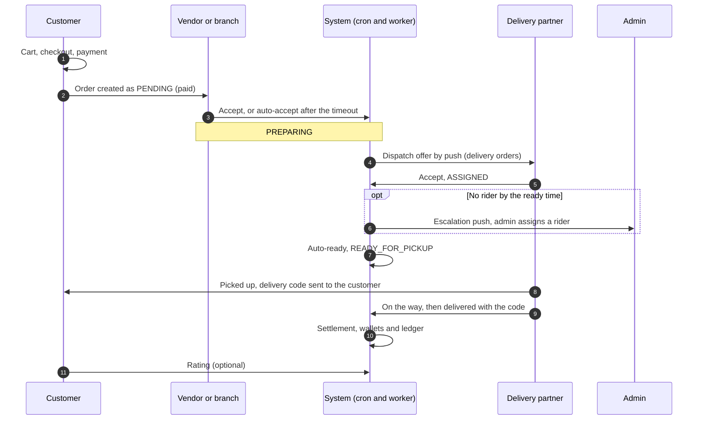

# Order Journey

This page follows **one order through every panel that touches it**, from the
customer's cart to the wallet credit and the rating. For each step it names the
actor, the action, the route or system job behind it, the state change, the
notifications and realtime events, and the page that owns the rules. It does not
restate those rules.

Paths are relative to `src/app/`. Statements come from the committed backend code.
Behavior read from code but not run is marked **Inferred**. Uncommitted
working-tree features are not described. The role and route overview is on
[User Panel Flows Overview](./overview.md); account setup that has to happen first
is on [Onboarding Journey](./onboarding-journey.md).

The backend does not define screens. "Action" below means what the API lets the
actor do; how a client presents it is not specified here.

---

## The journey at a glance

Two shapes share the first half of the journey:

| | Delivery order | Pickup order |
| --- | --- | --- |
| After payment | `PENDING` → `PREPARING` | `PENDING` → `PREPARING` |
| Next | `DISPATCHING` → `ASSIGNED` → `READY_FOR_PICKUP` | `READY_FOR_PICKUP` (vendor or cron) |
| Hand-over | Rider: `PICKED_UP` → `ON_THE_WAY` → `DELIVERED`, confirmed with the delivery code | Vendor verifies the customer's pickup code → `PICKED_UP_BY_CUSTOMER` |
| Not collected | Not applicable | `NO_SHOW` |
| Panels involved | Customer, vendor or branch, rider, admin on escalation | Customer and vendor or branch |

The status machine is on [Order Lifecycle](../03-orders/order-lifecycle.md#delivery-order-lifecycle).
The fleet manager has no step in either shape; see [Fleet manager](#where-the-fleet-manager-appears).

---

## Phase 1: Before the order exists

| # | Actor and panel | Action | Backend | State | Notifications and realtime | Owning page |
| --- | --- | --- | --- | --- | --- | --- |
| 1 | Customer | Finds a vendor and products | `GET /vendors/customer`, `GET /products`, `GET /search` | None | None | [Vendors and Branches](../04-vendors/vendors-and-branches.md#customer-vendor-discovery), [Products](../05-products/products.md), [Menus](../05-products/menus.md#two-discovery-paths-two-sets-of-rules) |
| 2 | Customer | Adds items to the cart | `POST /carts/add-to-cart` | Cart item added. Items of another vendor are deactivated | A warning push goes out shortly before the 12-hour inactivity expiry (cron) | [Cart](../08-cart/cart.md#adding-an-item) |
| 3 | Customer | Chooses an address (delivery) or a pickup time (pickup) | Address routes under `/customers`; `pickupTime` in the checkout body | Active address, or a pickup slot | None | [Customer Addresses](../03-identity-access/customer-addresses.md), [Checkout and Order Creation](../03-orders/checkout-and-order-creation.md#pickup-slot-rules) |
| 4 | Customer | Requests a checkout summary from the cart or one item | `POST /checkout` | `CheckoutSummary` saved. **No order exists** | None | [Checkout and Order Creation](../03-orders/checkout-and-order-creation.md#the-checkout-request) |
| 5 | Customer | Applies an offer (optional) | `POST /offers/validate-apply-offer` | Summary rebuilt with the discount | None | [Offers](../09-offers-and-coupons/offers.md) |
| 6 | Customer | Starts payment | `POST /payment/reduniq/create-payment-intent` (hosted page) or `pay-with-saved-token` | Summary `paymentStatus` `PROCESSING` (hosted page) | None | [Payments](../10-payments/payments.md#hosted-page-flow) |

Points worth knowing:

- **Discovery and cart do not filter alike.** Vendor lists drop vendors whose
  agreement is not signed; `GET /search` does not consult agreements, and the cart and
  checkout reject such a vendor later (`VENDOR_NOT_ACCEPTING_ORDERS`). **Inferred** for
  search.
- **Checkout is where the amounts are fixed.** Price, tax, delivery charge, commission
  and payouts are calculated here and copied into the order later as a snapshot.
- **A saved-card payment skips step 7**: it charges and creates the order in the same
  request, with no redirect and no separate confirmation.
- **How the customer reaches the gateway page** (the redirect) is client behavior; the
  backend only returns a redirect URL.

---

## Phase 2: Payment confirmed and the order created

| # | Actor and panel | Action | Backend | State | Notifications and realtime | Owning page |
| --- | --- | --- | --- | --- | --- | --- |
| 7 | Customer app or the payment gateway | Confirms the payment | `POST /orders/create-order`, or the gateway's `POST /payment/reduniq/notification` | After a verified payment, one transaction creates the `Order` (`PENDING`, paid), an `ORDER_PAYMENT` transaction, the offer reservation and the converted summary | After commit the `NEW_ORDER_POST_PROCESS` job pushes `ORDER_NEW_TO_VENDOR` to the owning vendor or branch, emails the customer a receipt with the invoice link, syncs the invoice and cleans the cart | [Checkout and Order Creation](../03-orders/checkout-and-order-creation.md#order-creation) |

- **Whichever confirmation arrives first creates the order.** The second is stopped by
  the unique gateway `transactionId`.
- **A failed payment leaves no order.** The customer resets the summary with
  `handle-payment-failure`; a payment that succeeded without an order is covered on
  [Payments](../10-payments/payments.md#payment-succeeded-but-no-order-was-created).
- **Creation does not re-check the store, the vendor's status or the agreement.**
  **Inferred:** a store that closes, or an agreement that lapses, between checkout and
  confirmation does not stop the order.
- **The customer gets an email, not a push, at this point.**

---

## Phase 3: The vendor responds

| # | Actor and panel | Action | Backend | State | Notifications and realtime | Owning page |
| --- | --- | --- | --- | --- | --- | --- |
| 8 | Vendor or branch | Sees the new order | Push `ORDER_NEW_TO_VENDOR`; `GET /orders`, `GET /orders/:orderId` | None | Push | [Order Tracking and Realtime](../03-orders/order-tracking-and-realtime.md#reading-orders) |
| 9a | Vendor or branch | Accepts with a preparation time | `PATCH /orders/:orderId/status` with `type: ACCEPTED` | `PENDING` → `PREPARING`. `estimatedReadyAt` is set and stock is deducted for non-restaurant vendors | Customer email only. Socket `ORDER_STATUS_UPDATED` to the customer and vendor | [Order Lifecycle](../03-orders/order-lifecycle.md#status-transition-rules) |
| 9b | Vendor or branch | Rejects with a reason | Same route, `type: REJECTED` | `PENDING` → `REJECTED`, `refundStatus: PENDING` | Customer push `ORDER_REJECTED_TO_CUSTOMER` and email | [Order Lifecycle](../03-orders/order-lifecycle.md#vendor-reject-and-cancel-patch-ordersorderidstatus) |
| 9c | System | Accepts for a vendor that did not respond | Auto-accept cron once `autoAcceptDeadlineAt` passes | Same as 9a, using the vendor's default preparation time | Same as 9a. No push to the vendor | [Order Automation](../03-orders/order-automation.md#auto-accept-autoacceptorder) |

- **Accepting rests in `PREPARING`.** `ACCEPTED` is written to the history only; it
  never appears as a current status.
- **A stock shortfall fails the accept** (`INSUFFICIENT_STOCK`) after the customer has
  already paid; the order stays `PENDING` and auto-accept retries.
- **The vendor panel depends on the agreement.** An approved vendor or branch with an
  unsigned effective agreement gets `403 AGREEMENT_RESIGN_REQUIRED` on every `/orders`
  route, reads included. The automatic jobs ignore agreements, so the order still
  auto-accepts and dispatches. See
  [Agreement gate and access consequences](./onboarding-journey.md#agreement-gate-and-access-consequences).
- **A parent vendor does not see its branches' orders.** Each row acts only on its own.

---

## Phase 4: Preparation and dispatch (delivery orders)

| # | Actor and panel | Action | Backend | State | Notifications and realtime | Owning page |
| --- | --- | --- | --- | --- | --- | --- |
| 10 | System, or the vendor | Offers the order to nearby riders | Auto-dispatch cron within `autoDispatchLeadMinutes` of `estimatedReadyAt`, or vendor `PATCH /orders/:orderId/broadcast-order` | `PREPARING` → `DISPATCHING`. Up to 10 approved, idle riders; 120-second window | Each rider gets a push `ORDER_NEW_DISPATCH_TO_PARTNER`. **No socket offer event** | [Delivery Dispatch](../03-orders/delivery-dispatch.md#making-an-offer) |
| 11a | Delivery partner | Accepts the offer | `PATCH /orders/:orderId/accept-dispatch-order` with `ACCEPT` | `DISPATCHING` → `ASSIGNED`; the rider becomes `ON_DELIVERY` | Vendor push `ORDER_ACCEPTED_BY_PARTNER_TO_VENDOR`; socket `ORDER_ACCEPTED_BY_PARTNER`; `REMOVE_ORDER_POPUP` to the riders | [Delivery Dispatch](../03-orders/delivery-dispatch.md#rider-response) |
| 11b | Delivery partner, or the clock | Rejects, or the window expires | `REJECT`, or the expiry cron | `AWAITING_PARTNER`; the cron retries while `estimatedReadyAt` is ahead | Socket `ORDER_DISPATCH_EXPIRED` to the vendor on expiry | [Order Lifecycle](../03-orders/order-lifecycle.md#status-transition-rules) |
| 11c | Delivery partner | Hands an assigned order back (reason required) | `update-order-status` with `REASSIGNMENT_NEEDED`, only from `ASSIGNED` | `ASSIGNED` → `REASSIGNMENT_NEEDED`; the rider is barred from this order | **No push** to the vendor or an admin | [Delivery Dispatch](../03-orders/delivery-dispatch.md#after-assignment) |
| 12 | Admin | Assigns a rider after escalation | `GET /orders/:orderId/nearby-partners`, `PATCH /orders/:orderId/assign-partner` (`CAN_MANAGE_ORDERS`) | `AWAITING_PARTNER` → `ASSIGNED` | Admins are pushed `ORDER_DISPATCH_ESCALATED_TO_ADMIN` once at escalation; the rider and vendor are pushed on assignment | [Delivery Dispatch](../03-orders/delivery-dispatch.md#admin-tools) |
| 13 | Vendor, or the clock | Marks a delivery order ready | The vendor's `READY_FOR_PICKUP` (optional; at once when a rider is assigned, otherwise `foodReadyAt` is stored and the order is released when a rider is assigned), or the auto-ready fallback 5 minutes after `estimatedReadyAt` | `ASSIGNED` → `READY_FOR_PICKUP` | Socket `ORDER_STATUS_UPDATED`. The fallback also pushes the admins and the assigned rider; a vendor's manual ready sends no rider push | [Order Automation](../03-orders/order-automation.md#auto-ready-autoreadyorder) |

- **A rider cannot mark an order ready.** The vendor can (optionally), or the
  auto-ready fallback does it 5 minutes after `estimatedReadyAt`, and the rider can
  move to `PICKED_UP` only from `READY_FOR_PICKUP`. So a rider cannot collect the food
  before the vendor confirmed it or the fallback ran.
- **Escalation is once per order, and automatic dispatch stops after it.** From then on
  only the vendor's manual broadcast or an admin can move the order. The vendor can
  broadcast again.
- **Offers are push-only.** The rider panel learns of an offer from the push, and can
  list open offers with `GET /orders/delivery-partner/dispatch-order`.
- **A rider holds one order at a time** in practice.

---

## Phase 5: Hand-over

### Delivery orders

| # | Actor and panel | Action | Backend | State | Notifications and realtime | Owning page |
| --- | --- | --- | --- | --- | --- | --- |
| 14 | Delivery partner | Collects the order | `PATCH /orders/:orderId/update-order-status` with `PICKED_UP` | `READY_FOR_PICKUP` → `PICKED_UP`; a six-digit delivery code is generated | Customer push `DELIVERY_OTP_TO_CUSTOMER`, email, and socket `DELIVERY_OTP_GENERATED`. The code is in the text of all three | [Order Lifecycle](../03-orders/order-lifecycle.md#important-business-rules) |
| 15 | Delivery partner | Sets on the way and shares location | `update-order-status` with `ON_THE_WAY`; socket `delivery-location-update` or `PATCH /delivery-partners/:id/liveLocation` | `PICKED_UP` → `ON_THE_WAY` | Vendor push `ORDER_STATUS_UPDATE_TO_VENDOR`; live position to the tracking room | [Order Tracking and Realtime](../03-orders/order-tracking-and-realtime.md#rider-live-location) |
| 16 | Delivery partner | Completes with the customer's code | `update-order-status` with `DELIVERED` and the six-digit `otp` | `ON_THE_WAY` → `DELIVERED`; a settlement job is queued | Vendor push; customer email `DELIVERED` | [Order Lifecycle](../03-orders/order-lifecycle.md#status-transition-rules) |

- **The customer reads the code from the order.** `GET /orders/:orderId` returns
  `deliveryOtp.code` to the customer only.
- **The code has five attempts.** The fifth wrong attempt locks the code and alerts
  the admins. An admin OTP reset (new code to the customer, the same rider continues)
  recovers it; a rider can also report a verification issue, and the customer can be
  asked to confirm receipt. See
  [Delivery Exceptions and Verification](../03-orders/delivery-exceptions.md).
- **A rider can raise an SOS from `READY_FOR_PICKUP` onward.** It is refused at
  `ASSIGNED` and earlier and at `DELIVERED` / `CANCELED`. An accepted SOS opens a
  `RIDER_SOS` exception and pushes the admins, who can acknowledge it, let the rider
  continue, replace the rider or cancel for a delivery fault; the customer is not told
  about the SOS, and the status does not change. See
  [SOS](../02-platform/sos.md#rider-sos-on-an-order).
- **Tracking has no ownership check.** Any authenticated customer, vendor, branch,
  rider or admin can join an order's tracking room, and a rider can publish positions
  to any order room. See the caveats on
  [Order Tracking and Realtime](../03-orders/order-tracking-and-realtime.md#rider-live-location).
- **A customer can still cancel after pickup.** The vendor is not notified if the order
  is already `PICKED_UP` or `ON_THE_WAY`; the rider is.

### Pickup orders

| # | Actor and panel | Action | Backend | State | Notifications and realtime | Owning page |
| --- | --- | --- | --- | --- | --- | --- |
| P1 | Vendor or branch, or the clock | Marks the order ready | `PATCH /orders/:orderId/status` with `READY_FOR_PICKUP`, or the auto-ready cron | `PREPARING` → `READY_FOR_PICKUP` | Customer push `ORDER_PICKUP_CODE_TO_CUSTOMER` (code in the text) and email | [Notification Flow](../02-platform/notification-flow.md#7-order-notifications) |
| P2 | System | Reminds the customer | Pickup reminder cron, about 15 minutes ahead | None | Customer push `ORDER_PICKUP_TIME_REMINDER_TO_CUSTOMER` | [Order Automation](../03-orders/order-automation.md#pickup-reminder-handlepickuptimeremindercron) |
| P3 | Vendor or branch | Verifies the customer's code | `PATCH /orders/:orderId/verify-pickup` | `READY_FOR_PICKUP` → `PICKED_UP_BY_CUSTOMER`; a settlement job is queued | Customer email `DELIVERED`; vendor and customer socket event | [Order Lifecycle](../03-orders/order-lifecycle.md#customer-pickup-lifecycle) |
| P4 | Vendor or branch, or the clock | Marks a no-show | `status` with `NO_SHOW` after a 15-minute grace, or the no-show cron | `READY_FOR_PICKUP` → `NO_SHOW`; settled like a completed order, without points | None | [Order Automation](../03-orders/order-automation.md#no-show-handleautonoshowcron-automarkordernoshow) |

- **The pickup code has no attempt limit.**
- **A pickup order never involves a rider or a fleet manager.**

---

## Phase 6: Completion, settlement and rating

| # | Actor and panel | Action | Backend | State | Notifications and realtime | Owning page |
| --- | --- | --- | --- | --- | --- | --- |
| 17 | System | Settles the order | `PROCESS_ORDER_POST_UPDATE` on the order queue, for `DELIVERED`, `PICKED_UP_BY_CUSTOMER` and `NO_SHOW` | One transaction awards points and referral bonuses (not for `NO_SHOW`), credits the vendor, rider, fleet manager and platform wallets, writes the ledger rows and frees the rider | None for the money itself | [Cancellations, Refunds and Settlement](../03-orders/cancellations-refunds-settlement.md#settlement) |
| 18 | Vendor, rider, fleet manager | Reads the balance | `GET /wallets/me`, `GET /payouts` | Wallet balance | None | [Payouts, Wallets and Transactions](../10-payments/payouts-wallets-transactions.md) |
| 19 | Customer | Rates the products and the rider | `POST /ratings/create-rating`, only after `DELIVERED` or `PICKED_UP_BY_CUSTOMER` | `Order.isRated` once everything is rated | None | [Ratings](../11-ratings/ratings.md#creating-ratings) |
| 20 | Customer, vendor, admin | Downloads the invoice | `GET /orders/:orderId/download-invoice-pdf` | None | None | [Order Tracking and Realtime](../03-orders/order-tracking-and-realtime.md#invoice) |

- **Settlement is asynchronous and separate from the status.** The order is already
  `DELIVERED` when the job runs. A failed job leaves a completed order with wallets not
  yet credited, and the retries follow the queue rules. A failing points call also
  aborts the settlement.
- **A managed rider's money goes to the fleet manager.** The fleet manager's wallet
  receives its fee plus the rider's earnings; the rider's own wallet is not credited.
  Payout is a separate flow, not part of the order.
- **`NO_SHOW` is paid out like a completed order**, and the order keeps
  `refundStatus: NOT_APPLICABLE`.
- **Rating cannot be edited or deleted**, and it sends no notification.

---

## Where the order ends early

These branches leave the main path. The comparison of each is on
[Cancellations, Refunds and Settlement](../03-orders/cancellations-refunds-settlement.md).

| Branch | Actor and panel | Route | Allowed from | Result | Told |
| --- | --- | --- | --- | --- | --- |
| Customer cancels | Customer | `PATCH /orders/:orderId/cancel` (reason required) | Any non-terminal status, including after assignment and after pickup | `CANCELED`; stock restored for the stages where it was deducted; rider freed. `refundStatus: PENDING` only if cancelled from `PENDING` | Vendor (unless already picked up) and the assigned rider |
| Vendor rejects | Vendor or branch | `PATCH /orders/:orderId/status` with `REJECTED` | `PENDING` | `REJECTED`, `refundStatus: PENDING` | Customer push and email |
| Vendor cancels | Vendor or branch | Same route with `CANCELED` | After accepting, before a rider is assigned | `CANCELED`, `refundStatus: PENDING`, stock restored | **No one** |
| Rider hands back | Delivery partner | `update-order-status` with `REASSIGNMENT_NEEDED` | `ASSIGNED` | Back into dispatch | **No one** |
| Pickup not collected | Vendor or branch, or the clock | `NO_SHOW` | Pickup order, ready, past the grace | `NO_SHOW`, settled | **No one found** |
| Refund | Admin | `POST /payment/reduniq/refund/:orderId` | `REJECTED` or `CANCELED` with a refund owed | `REFUNDED`; a `REFUND` transaction | Customer email |

**Nothing refunds automatically.** Cancel and reject only set `refundStatus`; an admin
performs the gateway refund. A customer cancel after the vendor has accepted ends with
`refundStatus: NOT_APPLICABLE`, which the refund route then refuses; the code does not
say whether a manual resolution exists outside the API.

---

## Where the fleet manager appears

A fleet manager has no order route to act on. It appears in three places:

- **Orders list.** `GET /orders` returns the orders of the riders it currently manages.
  It cannot open one order (`GET /orders/:orderId` does not list the role), and no
  order notification targets it.
- **Settlement.** The fleet manager's wallet is credited when a managed rider completes
  an order.
- **Rider management.** It onboards and submits its riders, as described on
  [Onboarding Journey](./onboarding-journey.md#delivery-partner).

---

## What each panel receives

The order produces few pushes. The full list by trigger is on
[Notification Flow](../02-platform/notification-flow.md#7-order-notifications); this is
the panel view.

| Panel | Pushes | Emails | Socket events |
| --- | --- | --- | --- |
| Customer | Vendor rejection, pickup ready (with the code), pickup reminder, delivery code | Receipt, accepted, rejected, pickup code, delivery code, delivered or picked up, refund | `ORDER_STATUS_UPDATED`, `DELIVERY_OTP_GENERATED` |
| Vendor or branch | New order, rider accepted or assigned, status updates on the way and delivered, customer cancellation | None found | `ORDER_STATUS_UPDATED`, `ORDER_ACCEPTED_BY_PARTNER`, `ORDER_DISPATCH_EXPIRED` |
| Delivery partner | Dispatch offer, assignment by an admin, customer cancellation after assignment | None found | `ORDER_STATUS_UPDATED`, `REMOVE_ORDER_POPUP` |
| Fleet manager | None found | None found | None found |
| Admin | Dispatch escalation | None found | None found |

There is **no push** to the customer for acceptance, preparation, assignment, on the
way or delivery, and none to anyone for vendor cancellation, rider hand-back or
`NO_SHOW`. Socket events are not persisted, and they reach a client only through its
own `user_<id>` room. Support and SOS are separate from the order state machine; see
[Support](../02-platform/support.md) and [SOS](../02-platform/sos.md).

---

## Unresolved and ambiguous points

- **Client-side behavior.** Which application opens the gateway page, shows the code,
  polls or listens for status changes, or lists offers is not defined by the backend.
- **Delivery order readiness.** The vendor may confirm a delivery order ready; when it
  does not, the auto-ready fallback applies after a 5-minute grace period. Whether a
  rider should be compensated for waiting is not stated.
- **Silent branches.** Vendor cancellation, rider hand-back and no-show notify no one.
  Whether that is intended is not stated.
- **Refund eligibility.** The code does not say what should happen to a customer who
  cancels after the vendor has accepted.
- **Order creation after a lapse.** That a closed store or lapsed agreement does not
  stop an already-paid order is **Inferred**.
- **Settlement retries.** What an operator does when a settlement job is exhausted is
  not described in the code.
- **Realtime reach.** Some events go to rooms that nobody joins, so only the `user_`
  room deliveries reach a client. The tracking room has no ownership check.
- **Points.** Points are awarded at settlement, but the committed code has no way to
  spend them.

---

## Related documentation

- [Order Lifecycle](../03-orders/order-lifecycle.md): every status and transition, with the actor for each.
- [Checkout and Order Creation](../03-orders/checkout-and-order-creation.md) and [Payments](../10-payments/payments.md): from checkout summary to a paid order.
- [Delivery Dispatch and Riders](../03-orders/delivery-dispatch.md) and [Order Automation](../03-orders/order-automation.md): offers, retries, escalation and the timed jobs.
- [Cancellations, Refunds and Settlement](../03-orders/cancellations-refunds-settlement.md): early endings, refunds and the wallet credits.
- [Notification Flow](../02-platform/notification-flow.md): every push, email and socket event.
- [Onboarding Journey](./onboarding-journey.md): the accounts that take part.
