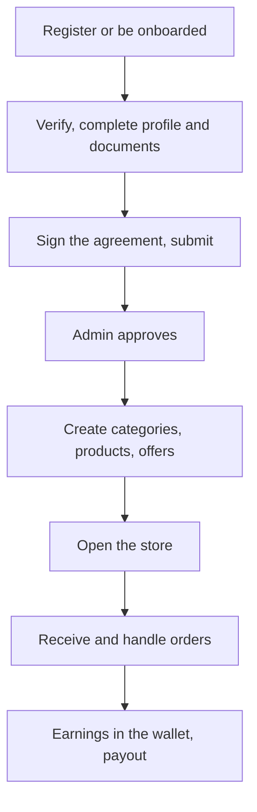

# Vendor Panel

This page describes the **vendor role** (`VENDOR`) and the **branch role**
(`SUB_VENDOR`) as the backend implements them: the routes they can call, the
workflows built from them, and where a branch is treated differently from its
parent. It builds on [User Panel Flows Overview](./overview.md),
[Onboarding Journey](./onboarding-journey.md) and [Order Journey](./order-journey.md),
and links to the technical pages for every rule instead of repeating them.

Paths are relative to `src/app/`. Statements come from the committed backend code.
Behavior read from code but not run is marked **Inferred**. Uncommitted working-tree
features are not described. The backend has no concept of a panel or a screen, so this
page says nothing about how a client presents these routes.

Unless a section says otherwise, "the vendor" means either role acting on **its own
row**. A parent and each branch are separate `Vendor` rows with their own products,
offers, orders, wallet and numbers.

---

## 1. Role purpose

The vendor runs a store: it publishes products, keeps the store open or closed,
responds to incoming orders, hands pickup orders to customers, and is paid through its
wallet. A parent vendor can also create and manage branches. A vendor's stake in an
order is **accepting or rejecting it, preparing it, optionally broadcasting it to
riders, and (for pickup) verifying the customer's code**.

---

## 2. Account and access

| Topic | Behavior | Owning page |
| --- | --- | --- |
| Creation | `VENDOR`: `POST /auth/register`, or onboarded by an admin. `SUB_VENDOR`: onboarded only, by its parent or by an admin sending `parentVendorId` | [Onboarding Journey](./onboarding-journey.md#vendor) |
| Verification | Email OTP at `POST /auth/verify-otp`; status stays `PENDING` | [User Lifecycle](../03-identity-access/user-lifecycle.md#verifications-place-in-the-lifecycle) |
| Sign-in | Password login with a verified email | [Authentication](../03-identity-access/authentication.md#flow-password-login) |
| Approval | `PENDING` → `SUBMITTED` → `APPROVED` by an admin. A vendor needs a party-signed agreement to submit; a branch needs none | [Onboarding Journey](./onboarding-journey.md#approval-rejection-correction-and-blocking) |
| Profile lock | The profile locks on submit and stays locked after approval. An approved vendor changes schedule, location or bank details only through an admin correction grant or an admin | [Vendors and Branches](../04-vendors/vendors-and-branches.md#profile-updates-the-lock-and-correction-requests) |
| Agreement | A `VENDOR` signs; a branch is covered by its parent's agreement and cannot read or sign | [Agreement Gate](../07-agreements/agreement-gate.md#vendor-parent-vendor-and-branch) |
| Password | `change-password`, `forgot-password` and `reset-password` are available to both roles | [Authentication](../03-identity-access/authentication.md#flow-forgot--reset-password) |

### What an unsigned agreement does

From the moment the account is `APPROVED`, an unsigned or outdated effective agreement
means `403 AGREEMENT_RESIGN_REQUIRED` on **every write** and on **every `/orders`
route, reads included**. Reads elsewhere (profile, products, notifications) still work.
Two consequences matter in practice:

- **Toggling the store is a write**, so a blocked vendor cannot open or close it.
- **The order routes disappear for the vendor, but the orders do not stop.** The
  automatic jobs ignore agreements, so a blocked vendor's paid orders still auto-accept
  and dispatch. Customers stop finding the vendor from the moment the new version takes
  effect.

Signing restores access at once; a branch recovers when its parent signs. See
[Agreement gate and access consequences](./onboarding-journey.md#agreement-gate-and-access-consequences)
and [Agreement Gate](../07-agreements/agreement-gate.md#re-sign-when-a-new-version-takes-effect).

---

## 3. Main capabilities

| Area | Routes | V | SV | Owning page |
| --- | --- | --- | --- | --- |
| Profile and documents | `GET /vendors/:vendorId`, `PATCH /vendors/:vendorId`, `PATCH` and `DELETE /vendors/:vendorId/docImage` | Y | Y | [Vendors and Branches](../04-vendors/vendors-and-branches.md#vendor-profile-and-key-fields) |
| Own profile through the shared route | `GET /profile` | Y | **No** | [Overview matrix](./overview.md#account-and-access) |
| Store open or closed | `PATCH /vendors/toggle/store-open-close` | Y | Y | [Vendors and Branches](../04-vendors/vendors-and-branches.md#store-openclose-and-timezone) |
| Branches | Onboard (`POST /auth/register/onboard`), submit (`PATCH /auth/:userId/submitForApproval`), `GET /vendors/:vendorId/branches` | Y | List only | [Vendors and Branches](../04-vendors/vendors-and-branches.md#parentbranch-permissions) |
| Products | `POST /products/create-product`, `PATCH /products/:productId`, the variation, inventory, price, status, images and soft-delete routes | Y | Y | [Products](../05-products/products.md#endpoints-and-roles) |
| Copy products to branches | `POST /products/copy-to-sub-vendors` | Y | **No** | [Vendors and Branches](../04-vendors/vendors-and-branches.md#copy-to-branches-post-productscopy-to-sub-vendors) |
| Categories and add-ons | `POST /product-categories`, `POST /add-ons/create-group` and their edit routes | Y | Y | [Products](../05-products/products.md#product-categories) |
| Offers | `POST /offers/create-offer`, `PATCH /offers/:offerId`, toggle, soft-delete, `GET /offers` | Y | Y | [Offers](../09-offers-and-coupons/offers.md#who-can-do-what) |
| AI product description | `POST /ai/generate-product-description` | Y | Y | [Products](../05-products/products.md) |
| Orders | `GET /orders`, `GET /orders/:orderId`, `PATCH /orders/:orderId/status`, `verify-pickup`, `broadcast-order`, `GET /orders/:orderId/download-invoice-pdf` | Y | Y | [Order Lifecycle](../03-orders/order-lifecycle.md#role-based-actions) |
| Ratings | `GET /ratings/get-all-ratings`, `GET /ratings/get-rating-summary`, `GET /ratings/:ratingId` | Y | Y | [Ratings](../11-ratings/ratings.md#reading-ratings) |
| Analytics | `/analytics/vendor-*`, `customer-insights`, `order-trend-insights`, `top-selling-analytics`, `vendor/*`, `offer-analytics` | Y | Y | [Analytics](../02-platform/analytics.md#vendor-and-branch-reports-vendor-sub_vendor) |
| Wallet and payouts | `GET /wallets/me`, `GET /payouts`, `GET /payouts/:payoutId` | Y | Y | [Payouts, Wallets and Transactions](../10-payments/payouts-wallets-transactions.md) |
| Ledger and history | `GET /transactions` (own rows), `GET /login-histories` (own rows) | Y | Y | [Payouts, Wallets and Transactions](../10-payments/payouts-wallets-transactions.md#reading-transactions) |
| Ingredient purchasing | `GET /ingredients`, `POST /payment/ingredient/create-payment-intent`, `POST /ingredients-order/create-order`, `GET /ingredients-order/vendor/my-orders` | Y | Y | [Ingredient Purchasing](../04-vendors/ingredient-purchasing.md) |
| Reference data | `GET /taxes`, `GET /restricted-items` | Y | Y | [Platform Settings](../02-platform/platform-settings.md#taxes) |
| Referral statistics | `GET /referrals/my-referrals` | Y | **No** | [Points and Referrals](../09-offers-and-coupons/points-and-referrals.md#statistics-get-referralsmy-referrals) |
| Support | `POST /support/send-message`, `GET /support/tickets`, messages, read | Y | List only | [Support](../02-platform/support.md#who-can-do-what) |
| SOS | `POST /sos/trigger`, `GET /sos` | Y | Y | [SOS](../02-platform/sos.md) |
| Notifications | All `/notifications` routes except `broadcast` | Y | Y | [Notifications](../06-notifications/notifications.md#in-app-notification-apis) |
| Files | `POST /uploads` | Y | **No** | [Overview matrix](./overview.md#account-and-access) |

---

## 4. End-to-end workflows

| Workflow | Steps | Where the detail is |
| --- | --- | --- |
| **Become active** | Register, verify, profile and documents, sign, submit, approval; correction grants if an admin asks | [Onboarding Journey](./onboarding-journey.md#vendor) |
| **Build the catalog** | Create a category (active, owned), then products in it, with variations, add-on groups, stock and price. A product is not shown to customers until an admin approves it and it is `ACTIVE` | [Products](../05-products/products.md#creating-a-product), [Products](../05-products/products.md#approval-status-and-deletion) |
| **Run the store** | Set hours, closing days and timezone in the profile, or toggle manually. A manual toggle lasts until the vendor's next local midnight window | [Vendors and Branches](../04-vendors/vendors-and-branches.md#the-cron-cronvendorstorecronets) |
| **Run offers** | Create, toggle, soft-delete (the offer must be inactive first) an offer. A branch's offers apply only to that branch | [Offers](../09-offers-and-coupons/offers.md) |
| **Manage branches** | Onboard a branch, which copies the parent's business, bank and document data once. Submit it. Copy products to it. The parent cannot edit the branch's products, offers or orders | [Vendors and Branches](../04-vendors/vendors-and-branches.md#branch-lifecycle-and-cloning) |
| **Handle an order** | Section 5 | [Order Journey](./order-journey.md#phase-3-the-vendor-responds) |
| **Buy ingredients** | Read the catalog, create a payment intent (stock is reserved), pay on the gateway page, confirm. An admin ships and delivers | [Ingredient Purchasing](../04-vendors/ingredient-purchasing.md#the-purchase-flow) |
| **Follow earnings** | `GET /wallets/me`, `vendor/earnings-analytics`, `GET /payouts` | Section 6 |

There is **no menu system.** A vendor's menu is its products and categories; there are
no menu, section or ordering routes, and no menu import in the committed code. See
[Menus](../05-products/menus.md#verdict-is-there-a-menu-system).

---

## 5. Order responsibilities

The vendor acts on orders whose `vendorId` is its own row. A parent does not see or act
on its branches' orders.

| Status | Vendor action | Route | Result |
| --- | --- | --- | --- |
| `PENDING` | Accept with `preparationTime` | `PATCH /orders/:orderId/status` with `ACCEPTED` | Rests in `PREPARING`; `estimatedReadyAt` is set; stock deducted for non-restaurant vendors. `INSUFFICIENT_STOCK` can fail it after payment |
| `PENDING` | Reject with a reason | Same, `REJECTED` | `REJECTED`; `refundStatus: PENDING`; customer pushed |
| `PENDING` | Do nothing | Auto-accept cron after `autoAcceptTimeoutMinutes` | Same effects as accept, using the vendor's default preparation time |
| `PREPARING`, `DISPATCHING`, `AWAITING_PARTNER` or `REASSIGNMENT_NEEDED` | Cancel with a reason | Same, `CANCELED` | `CANCELED`; `refundStatus: PENDING`; **no one is told** |
| `PREPARING`, `AWAITING_PARTNER` or `REASSIGNMENT_NEEDED` (delivery) | Broadcast to riders now | `PATCH /orders/:orderId/broadcast-order` | `DISPATCHING`, searched around the vendor's session location; otherwise the auto-dispatch cron does it |
| `PREPARING` (pickup) | Mark ready | `status` with `READY_FOR_PICKUP` | Customer receives the pickup code |
| `PREPARING`, `DISPATCHING`, `AWAITING_PARTNER`, `REASSIGNMENT_NEEDED` or `ASSIGNED` (delivery) | Mark ready (optional) | `status` with `READY_FOR_PICKUP` | With a rider assigned: `READY_FOR_PICKUP` at once. Otherwise the status is unchanged and `foodReadyAt` is stored; the order becomes `READY_FOR_PICKUP` when a rider is assigned. No rider push |
| `READY_FOR_PICKUP` (pickup) | Verify the customer's code | `PATCH /orders/:orderId/verify-pickup` | `PICKED_UP_BY_CUSTOMER`; settlement queued |
| `READY_FOR_PICKUP` (pickup) | Mark no-show after the grace | `status` with `NO_SHOW` | `NO_SHOW`; settled; the no-show cron also does it |

Rules that shape the vendor's role:

- **Marking a delivery order ready is optional.** If the vendor does not, the
  auto-ready cron moves an `ASSIGNED` delivery order to `READY_FOR_PICKUP` 5 minutes
  after `estimatedReadyAt`, alerts the admins and pushes the assigned rider. See
  [Order Automation](../03-orders/order-automation.md#auto-ready-autoreadyorder).
- **The vendor can confirm food ready early, but cannot change the ready time.**
  `estimatedReadyAt` is set once at acceptance and never changed. Confirming a delivery
  order ready records `foodReadyAt`, and the order becomes `READY_FOR_PICKUP` once a rider
  is assigned (or at once if one already is). There is no preparation-time extension route
  or logic. See
  [Order Automation](../03-orders/order-automation.md#auto-ready-autoreadyorder).
- **A vendor cannot cancel once a rider is assigned**, or a pickup order that is
  `READY_FOR_PICKUP`. It must reject (from `PENDING`) or cancel (after accepting).
- **Order actions need an `APPROVED` profile** and a paid order, and the agreement gate
  applies to all of `/orders`.
- **The vendor is not involved in assigning a rider** beyond the manual broadcast. After
  escalation an admin assigns, and the vendor is pushed when a rider accepts or is
  assigned.

Details: [Order Lifecycle](../03-orders/order-lifecycle.md#status-transition-rules),
[Order Automation](../03-orders/order-automation.md),
[Delivery Dispatch](../03-orders/delivery-dispatch.md).

---

## 6. Money, payment and settlement

| Topic | Behavior | Owning page |
| --- | --- | --- |
| Earnings | Credited to the **row that owns the order** when it completes (`DELIVERED`, `PICKED_UP_BY_CUSTOMER`, `NO_SHOW`): `vendorNetPayout` into `currentBalance` and `lifetimeEarnings`, plus a `VENDOR_EARNING` ledger row | [Cancellations, Refunds and Settlement](../03-orders/cancellations-refunds-settlement.md#settlement) |
| Wallet | Created on the first credit, so a vendor with no completed order gets `404 WALLET_NOT_FOUND_FOR_USER` from `GET /wallets/me`. A branch has its own wallet | [Payouts, Wallets and Transactions](../10-payments/payouts-wallets-transactions.md#how-wallets-are-created-and-credited) |
| Payouts | **A vendor cannot request or finalize one.** Payout requests are fleet-manager only, and finalizing is for admins and fleet managers. A vendor is paid only by the automatic daily run, when the global setting is on and today is a payout day, and an admin finalizes it. It can read its payouts | [Payouts, Wallets and Transactions](../10-payments/payouts-wallets-transactions.md#automatic-payouts) |
| Payout notification | The vendor is pushed when a payout is finalized. Creating the automatic payout sends nothing, except an alert when bank details are incomplete | Same page |
| Bank details | Needed for an automatic payout; they live on the profile and are locked after approval | [Vendors and Branches](../04-vendors/vendors-and-branches.md#correction-requests-vendor-specifics) |
| Commission and tax | Fixed into the order's payout snapshot at checkout; the vendor reads the result in analytics and the tax reports, not the commission rules | [Data Model](../02-platform/data-model.md#platform-commission-effective-dated), [Analytics](../02-platform/analytics.md#what-the-money-figures-come-from) |
| Refunds | Not the vendor's action. A reject or cancel sets `refundStatus: PENDING`; an admin refunds | [Cancellations, Refunds and Settlement](../03-orders/cancellations-refunds-settlement.md#refunds) |
| Ingredient purchases | The vendor pays the gateway for ingredient orders; it is a separate purchase flow with no refund or cancel route | [Ingredient Purchasing](../04-vendors/ingredient-purchasing.md) |
| Transactions | The list returns the whole populated order for each of the vendor's rows, including the platform split | [Payouts, Wallets and Transactions](../10-payments/payouts-wallets-transactions.md#reading-transactions) |

---

## 7. Notifications and realtime

| Channel | What the vendor receives | Owning page |
| --- | --- | --- |
| Push | New order, rider accepted or assigned, status updates on the way and delivered, customer cancellation, stock alerts from an admin, account and correction messages, payout finalized, agreement version (parent only), admin broadcasts | [Notifications](../06-notifications/notifications.md#who-can-receive-and-read-notifications), [Notification Triggers and Templates](../06-notifications/notification-triggers.md) |
| Email | Account, approval and correction emails; agreement emails for a parent. No order emails were found | [Notification Flow](../02-platform/notification-flow.md#8-other-notification-sources) |
| Socket, orders | `ORDER_STATUS_UPDATED`, `ORDER_ACCEPTED_BY_PARTNER`, `ORDER_DISPATCH_EXPIRED` through the vendor's own `user_<id>` room | [Order Tracking and Realtime](../03-orders/order-tracking-and-realtime.md#order-events) |
| Socket, store | `vendor-store-status-updated` to the vendor's own `vendor-store-status:<userId>` room, which a vendor may join only for itself | [Vendors and Branches](../04-vendors/vendors-and-branches.md#who-reads-store-state) |
| Tracking | A vendor may join an order's tracking room | [Order Tracking and Realtime](../03-orders/order-tracking-and-realtime.md#rider-live-location) |

Orders notify **the branch row that owns the order**, never its parent. A new-order push
goes to the owning row only. There is **no push** when the vendor cancels an order, when a
rider hands one back, or when a pickup order becomes `NO_SHOW`. The socket payloads of
some status paths include `pickup.code`; see the note on
[Order Tracking and Realtime](../03-orders/order-tracking-and-realtime.md#order-events).

---

## 8. Support and SOS

| Topic | Parent vendor | Branch |
| --- | --- | --- |
| Send a support message | Yes. A referenced order must be the vendor's own | **No** (not in the route list) |
| List tickets | Own | Own |
| Read messages, mark read | Own | **No** |
| Close a ticket | Not over REST; the socket path has no role check | Same |
| Raise an SOS | Yes (`POST /sos/trigger`), needs a stored GPS location | Yes |
| List SOS alerts | Yes (`GET /sos`), its own alerts | Yes |
| Read one SOS alert | **No** (`GET /sos/:id` is admin and fleet manager) | **No** |

A branch can therefore list support tickets it cannot send to or read, and both vendor
roles can list their SOS alerts but not open one. Owning pages:
[Support](../02-platform/support.md#who-can-do-what), [SOS](../02-platform/sos.md#reading-alerts-over-rest).

---

## 9. Restrictions and route gaps

### Parent vendor versus branch

| Area | Parent `VENDOR` | Branch `SUB_VENDOR` |
| --- | --- | --- |
| Agreement | Reads and signs its own | Cannot read or sign; the parent signs. Its access follows the parent's row |
| Own profile via `GET /profile` | Yes | **No**; uses `GET /vendors/:vendorId` |
| `GET /vendors/:vendorId` | Itself and its own branches | Itself only; not the parent or a sibling |
| `GET /vendors/:vendorId/branches` | Its branches | The branches of the same parent |
| Onboarding | Creates branches | Cannot create anything |
| Copy products to branches | Yes | **No** |
| Support send and read | Yes | **No** (can list tickets) |
| Referral statistics | Yes | **No** |
| `POST /uploads` | Yes | **No** |
| Permanent delete of an offer | Reaches the service and is refused there | Not in the route list |
| Orders, products, offers, wallet, analytics | Its own row only | Its own row only |

### Other route asymmetries

| Area | Asymmetry | Owning page |
| --- | --- | --- |
| Categories and add-ons | A vendor creates them and deletes its own, but **admins cannot delete categories**, and add-on soft-delete is owner-only; admins have separate `admin/create-…` routes | [Products](../05-products/products.md#product-categories) |
| Product creation | Needs an `APPROVED` owner. Products also need admin approval to be visible | [Products](../05-products/products.md#approval-status-and-deletion) |
| Rating summary | The route admits six roles but the summary is effectively vendor-only | [Ratings](../11-ratings/ratings.md#summary-get-rating-summary) |
| Customer reads | `GET /customers/:customerId` lists vendors on the route but is effectively admin-only | [Customer Addresses](../03-identity-access/customer-addresses.md#what-reads-these-values) |
| Order creation checks | Not re-checked at creation, and cart and checkout do not check the vendor's approval status, only `isStoreOpen` | [Vendors and Branches](../04-vendors/vendors-and-branches.md#known-implementation-inconsistencies) |
| Parent and branch status | Blocking or deleting a parent does not touch its branches. A branch of a blocked parent can still be ordered from | Same page |
| Single-vendor customer endpoints | Unfiltered by approval or agreement | Same page |
| Cron | Only `APPROVED` vendors are touched, so a vendor that leaves `APPROVED` keeps its last open or closed state | [Vendors and Branches](../04-vendors/vendors-and-branches.md#who-reads-store-state) |
| Branch counters | `totalBranches` is client-editable | [Vendors and Branches](../04-vendors/vendors-and-branches.md#known-implementation-inconsistencies) |
| Restricted items | The vendor can list the platform's restricted items, but no code consumes them | [Platform Settings](../02-platform/platform-settings.md#restricted-items) |
| Payout | No request route for vendors; the fleet manager's request route currently fails validation | [Payouts, Wallets and Transactions](../10-payments/payouts-wallets-transactions.md#manual-request-post-payoutsinitiate-settlement) |

---

## Unresolved and ambiguous points

- **Client behavior.** Which screen shows incoming orders, how a blocked vendor is told
  to sign, or how the store toggle is presented is not defined by the backend.
- **The branch's missing routes** (profile, uploads, support, referrals, agreement) are
  read from the route lists. Whether each is intended is not stated.
- **Branch eligibility.** Whether a branch should ever sign separately, or follow its
  parent's status as well as its agreement, is a product decision.
- **Locked profile after approval.** Whether the permanent lock is intended is not stated.
- **Silent endings.** That vendor cancellation, rider hand-back and no-show notify nobody
  is read from code; whether it is intended is not stated.
- **Gate behavior on logout and push-token routes** for a blocked vendor is **Inferred**.
- **Automatic payout timing.** Whether payouts will actually be created depends on global
  settings and a `SUPER_ADMIN` existing, which the code does not guarantee.

---

## Related documentation

- [User Panel Flows Overview](./overview.md), [Onboarding Journey](./onboarding-journey.md), [Order Journey](./order-journey.md): the shared layer.
- [Vendors and Branches](../04-vendors/vendors-and-branches.md): profile, branches, store state, discovery and inconsistencies.
- [Agreements](../07-agreements/agreements.md) and [Agreement Gate](../07-agreements/agreement-gate.md): signing and the gate.
- [Products](../05-products/products.md), [Menus](../05-products/menus.md), [Offers](../09-offers-and-coupons/offers.md): the catalog and promotions.
- [Order Lifecycle](../03-orders/order-lifecycle.md), [Order Automation](../03-orders/order-automation.md), [Delivery Dispatch](../03-orders/delivery-dispatch.md): the order and its timers.
- [Payouts, Wallets and Transactions](../10-payments/payouts-wallets-transactions.md), [Ingredient Purchasing](../04-vendors/ingredient-purchasing.md), [Analytics](../02-platform/analytics.md): money and reports.
